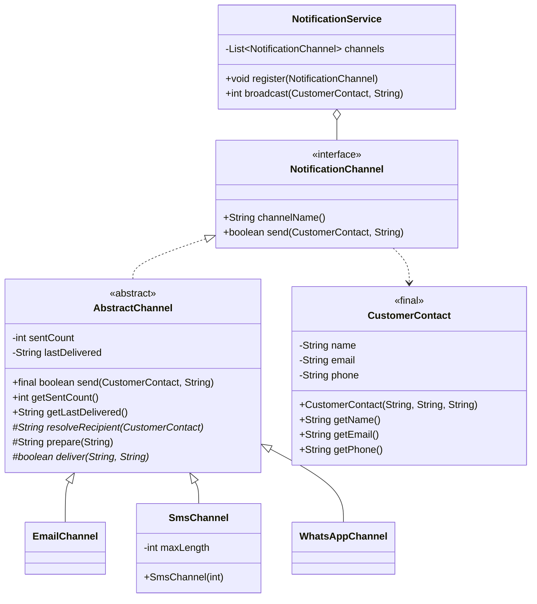

# UML T2 — Sistem Notifikasi

```mermaid
classDiagram
    class NotificationChannel {
        <<interface>>
        +String channelName()
        +boolean send(CustomerContact, String)
    }
    class AbstractChannel {
        <<abstract>>
        -int sentCount
        -String lastDelivered
        +final boolean send(CustomerContact, String)
        +int getSentCount()
        +String getLastDelivered()
        #String resolveRecipient(CustomerContact)*
        #String prepare(String)
        #boolean deliver(String, String)*
    }
    class EmailChannel
    class SmsChannel {
        -int maxLength
        +SmsChannel(int)
    }
    class WhatsAppChannel
    class NotificationService {
        -List~NotificationChannel~ channels
        +void register(NotificationChannel)
        +int broadcast(CustomerContact, String)
    }
    class CustomerContact {
        <<final>>
        -String name
        -String email
        -String phone
        +CustomerContact(String, String, String)
        +String getName()
        +String getEmail()
        +String getPhone()
    }
    NotificationChannel <|.. AbstractChannel
    AbstractChannel <|-- EmailChannel
    AbstractChannel <|-- SmsChannel
    AbstractChannel <|-- WhatsAppChannel
    NotificationService o-- NotificationChannel
    NotificationChannel ..> CustomerContact
```

`TugasApp` juga membuat anonymous class yang mengimplementasikan `NotificationChannel` untuk log konsol.
